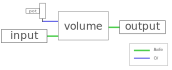

# Demiure Sound Processing Engine

The Demiurge Sound Processing Engine (DSPE) is a zero-latency, streaming digital 
sound, processing platform that handles the real-time aspect of the Demiurge
family of products from Awesome Audio Apparatus.

The principle is that the programmer binds blocks together during startup,
on how the digital samples should propogate from block to block and eventually
reach the outputs. The timing and execution of that in real-time is handled
by the DSPE and the maker, implementor or advanced user can focus on the
(possibly no) other tasks that should be handled.

## Example - Volume Control
The following code shows the simplest possible example of a DSPE program. 



```C
static audio_inport_t input;   // Declaration of Audio Input Port
static audio_outport_t output; // Declaration of Audio Output Port
static potentiometer_t pot;    // Declaration of Potentiometer Input Port
static volume_t volume;        // Declaration of Volume block

void setup() {
  audio_inport_init(&input, 1);  // Audio Input on first input port
  audio_outport_init(&output, 1); // Audio Output on first output port
  potentiometer_init(&pot, 1);   // First potentiometer
  volume_init(&volume);          // Initialize Volume block
  
  volume_configure_input(&volume, &input);  // Set input of Volume to the Input Port.
  volume_configure_control(&volume, &pot);  // Set the Volume control to the Potentiometer
  
  audio_output_configure_input( &output, &volume);  // Set the Volume output to the Audio Output port
}

void loop()
{
    // Nothing needed here.
}
```

# Audience
This documentation is intended for C programmers that want to create new
Eurorack Modules with the Demiurge Hardware Platform, which can be purchased
at a low cost at https://awesomeaudioapparatus.com, either as a kit or
fully assembled (without frontpanel, which can be ordered separately in
case volume production is intended)

# Continued Reading
   * [Execution Model](docs/model.md)
   * [Installation](docs/installation.md)
   * [Usage](docs/usage.md)
   * [Blocks](docs/blocks.md)
   * [Functions](docs/functions.md)
   * [Examples](docs/examples.md)